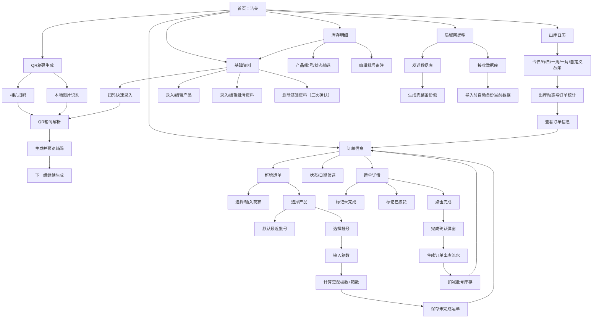
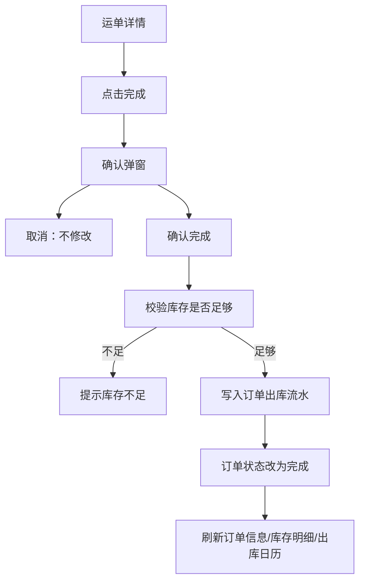
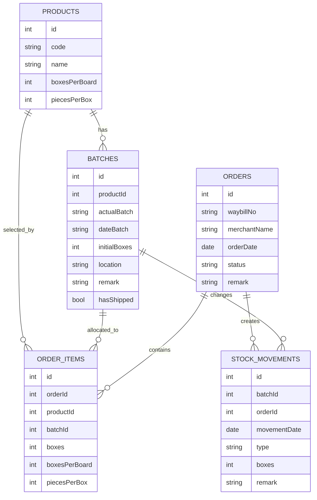
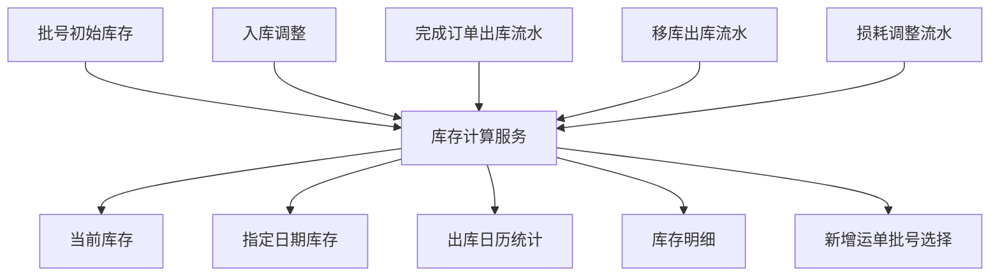

# 洁美功能调用关系与组件逻辑

更新时间：2026-04-26

## 1. 页面总览

首页只保留 6 个主入口：

```text
洁美首页
- QR箱码
- 订单信息
- 出库日历
- 库存明细
- 局域网迁移
- 基础资料
```

不保留独立页面：

```text
备份导入：并入局域网迁移
每日订单：并入订单信息的日期/范围筛选状态
```

## 2. 总流程图



## 3. 首页组件逻辑

### 3.1 顶部品牌区

组件：

```text
BrandHeader
- 图标：标题左侧，不单独占顶部一行
- 标题：洁美
- 副标题：浙江仓订单与库存工作台
```

规则：

- 页面图标统一放在标题左侧。
- 首页总库存只显示件数，不显示总箱数。

### 3.2 总库存卡片

显示：

```text
总库存
3,317,144 件
总订单 19 单 · 今日新增 3 单 · 未完成 7 单
```

数据来源：

- 总库存件数：库存服务按当前日期实时计算。
- 总订单、今日新增、未完成：订单服务聚合。

### 3.3 功能入口

```text
QR箱码 -> QR箱码生成
订单信息 -> 订单信息
出库日历 -> 出库日历
库存明细 -> 库存明细
局域网迁移 -> 局域网迁移
基础资料 -> 基础信息录入
```

## 4. QR箱码生成

### 4.1 按钮与调用

```text
开始扫码 -> 打开相机扫描 -> 返回二维码字符串 -> QR解析 -> 生成预览
导入图片 -> 调用本地图片识别 -> 返回二维码字符串 -> QR解析 -> 生成预览
生成并预览 -> 使用最近一次成功解析的箱码和当前参数构建箱码列表 -> 进入预览页
下一组继续 -> 基于上一组序号继续生成
```

按钮可用规则：

```text
未成功扫码/导入图片前，生成并预览、下一组继续不可用。
顺序/随机、末3位/末4位只影响生成序号，不影响库存。
QR箱码生成页面不处理库存为0批号过滤；该规则只属于新增运单的批号选择。
```

### 4.2 组件

```text
QrEntryScreen
- ScanCard
- GenerateParamCard
- PreviewActionBar

QrScannerScreen
- CameraScanner
- GalleryPicker

QrPreviewScreen
- QRPageView
- AutoSlideControl
- NextGroupButton
```

### 4.3 核心逻辑

- 复用现有 `QrParser` 解析规则。
- 生成数量支持预设和手动输入。
- 自动滑动间隔由用户设置。
- 随机模式支持末 3 位或末 4 位随机。

## 5. 订单信息

### 5.1 页面职责

订单信息是唯一的订单列表页。它同时承接：

```text
首页 -> 订单信息
出库日历 -> 查看订单信息（带日期/范围筛选）
新增运单保存后 -> 返回订单信息
运单详情状态修改后 -> 返回/刷新订单信息
```

### 5.2 状态

订单状态固定为三种：

```text
未完成：橙色
已拣货：蓝色
完成：绿色
```

### 5.3 按钮与调用

```text
新增运单 -> 新增运单页面
日历图标 -> 打开日期/范围筛选
状态 Tab -> 切换订单列表
订单卡片 -> 运单详情
```

### 5.4 筛选上下文

订单信息页面接收可选筛选参数：

```text
dateRange: 今日 / 昨日 / 一周 / 一月 / 自定义
status: 未完成 / 已拣货 / 完成
source: 首页 / 出库日历
```

出库日历不打开独立“每日订单”页面，只跳转到订单信息并带上 `dateRange`。

## 6. 新增运单

### 6.1 页面职责

用于新增或编辑未完成运单。

### 6.2 按钮与调用

```text
日期按钮 -> 选择运单日期，默认今天
运单号输入 -> 必须手动填写，不提供扫码填入
商家选择 -> 打开历史商家选择器
产品选择 -> 打开产品选择器
批号选择 -> 打开批号选择器，默认最近批号
箱数输入 -> 实时计算需配板数+箱数
暂存 -> 保存草稿/未完成运单，停留或返回订单信息
完成 -> 完成本次录入并保存运单，订单状态仍为未完成，不扣库存
```

注意：新增运单页的 `完成` 表示“完成录入/保存”，不是订单状态 `完成`，不会扣库存。只有运单详情页的 `完成` 按钮在确认后才扣库存。

### 6.3 商家选择逻辑

```text
历史商家 Top10 = 按最近使用频率排序
支持选择历史商家
支持输入新商家
新商家保存订单后进入历史统计
```

### 6.4 产品明细逻辑

显示结构：

```text
产品      批号
72067    FCHBLEZ 2029.9.7

箱数：8
可用：3477箱
需配：0板+8箱
规格：40箱/板  30件/箱
```

规则：

- 产品只显示产品编号。
- 批号格式使用 `实际批号 YYYY.M.D`。
- 批号默认调用该产品最近使用批号。
- 只允许选择当前日期库存大于 0 的批号。
- 输入箱数不能超过可用库存。

## 7. 运单详情

### 7.1 页面职责

查看运单明细、修改状态、完成扣库存。

### 7.2 按钮与调用

```text
未完成 -> 状态改为未完成，不扣库存
已拣货 -> 状态改为已拣货，不扣库存
完成 -> 弹出确认 -> 生成订单出库流水 -> 扣库存 -> 状态改为完成
编辑 -> 仅未完成/已拣货允许编辑明细
```

### 7.3 完成确认流程



## 8. 库存明细

### 8.1 页面职责

查看批号库存、规格、是否发过、备注，并支持高频修改备注。

### 8.2 显示字段

```text
72067 · 批号 FCGBKEZ · 2029.9.6
库存：55,740箱
板数：1393板+20箱
规格：40箱/板  30件/箱
是否发过：是/否
备注：录入页/库存明细维护的备注
```

### 8.3 按钮与调用

```text
筛选产品 -> 更新批号列表
筛选批号 -> 更新批号列表
编辑备注 -> 直接保存到批号资料
录入 -> 基础资料新增模式
编辑资料 -> 从库存批号卡片进入基础资料编辑模式，带入当前产品/批号
```

规则：

- 修改入口放在库存明细的具体产品批号卡片上，而不是首页单独入口。
- 删除仍属于高风险操作，只能在基础资料编辑模式中二次确认。

## 9. 基础资料

### 9.1 页面职责

维护产品、批号、规格、库位、初始库存和备注。

### 9.2 按钮与调用

```text
扫码图标 -> 复用 QR箱码解析规则 -> 自动填充可识别字段
保存 -> 新增产品/批号资料，保存后清空全部输入，等待下一条资料
保存并继续同产品 -> 保留产品编号/名称/每箱件数，清空批号、库存件数、每板箱数等批号字段
删除 -> 二次确认 -> 删除基础资料
取消 -> 返回来源页
```

### 9.3 字段

```text
产品编号
产品名称
实际批号
日期批号
库存件数
每板箱数（批号/码放方式级别，同产品不同批号可以不同）
每箱件数
库位
备注
```

## 10. 出库日历

### 10.1 页面职责

按日期或范围查看实时总库存、出货动态和订单统计。

### 10.2 范围选择

```text
今日
昨日
一周
一月
自定义范围
```

页面只显示日期，不显示 `00:00` 这种时间。

### 10.3 按钮与调用

```text
范围按钮 -> 更新当前统计范围
自定义范围图标 -> 打开日期范围选择器
查看订单信息 -> 进入订单信息，并携带当前范围
查看库存明细 -> 进入库存明细
```

### 10.4 显示规则

```text
实时总库存：只显示件数
当日出库明细：按产品编号 + 批号显示箱数和板数
订单信息：显示未完成/已拣货/完成数量、当日新增、最近完成
```

## 11. 局域网迁移

### 11.1 页面职责

承接数据迁移、发送/接收数据库，以及原本“备份导入”的能力。

### 11.2 按钮与调用

```text
发送数据库 -> 生成临时备份包 -> 启动局域网服务 -> 显示配对码/二维码
接收数据库 -> 输入配对码或扫码 -> 下载备份包 -> 导入前自动备份当前数据 -> 导入
```

### 11.3 备份包

```text
SQLite 数据库文件
backup_info.json
```

## 12. 数据模型关系



## 13. 库存计算关系



计算规则：

```text
某日期批号库存 =
初始库存
+ 截止该日期的入库调整
- 截止该日期的完成订单出库
- 截止该日期的移库出库
- 截止该日期的损耗调整
```

总库存件数：

```text
sum(批号库存件数)
```

## 14. 第一版组件边界

```text
lib/features/home
- 首页工作台

lib/features/qr
- QR解析、扫描、预览

lib/features/orders
- 订单信息、新增运单、运单详情、商家选择、产品批号选择

lib/features/inventory
- 库存明细、库存计算、备注编辑、库存流水

lib/features/base_info
- 产品/批号基础资料录入编辑

lib/features/calendar
- 出库日历、范围筛选、出库统计

lib/features/transfer
- 局域网迁移、备份导入导出

lib/data
- SQLite/drift 数据库、DAO、表结构

lib/shared
- 通用主题、标题栏、卡片、按钮、日期格式、板数计算
```
